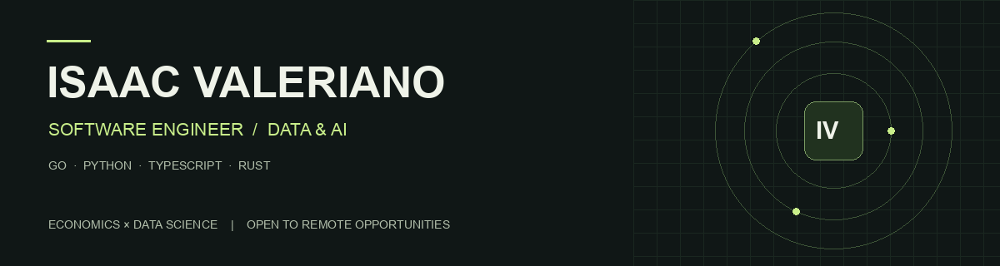

# Olá, sou Isaac Valeriano

Engenheiro de software com experiência em **backend no DIT/IFAL** e projetos pessoais em aplicações web, integração de IA e dados de mercado. Curso **Ciências Econômicas na UFAL** e **Data Science no Instituto Infnet**.

**Busco oportunidades 100% remotas no Brasil ou no exterior** em Backend, Full Stack e Dados/IA. Tenho interesse especial em produtos que conectam software, economia e mercado financeiro.

[Portfólio](https://isaacvaleriano.netlify.app) · [LinkedIn](https://www.linkedin.com/in/isaacvaleriano/) · [Currículo PDF](https://isaacvaleriano.netlify.app/curriculo.pdf) · [Contato](mailto:isaac119eu@gmail.com)

## Projetos em destaque

| Projeto | O que exploro | Tecnologias |
| --- | --- | --- |
| [EduRepo](https://github.com/yMScorpion/EduRepo) | Repositórios acadêmicos, versionamento, auditoria e controle de acesso | Next.js, TypeScript, Prisma, PostgreSQL, Redis |
| [StratHUB](https://github.com/yMScorpion/StratHUB) | Ingestão de documentos e especificações estruturadas de estratégias; em desenvolvimento | Python, FastAPI, TypeScript, Rust, JSON Schema |
| Argus · privado | Fundação para dados de mercado: order book L2, replay e testes de propriedades; em desenvolvimento | Rust, IPC, Prometheus |
| AIBE · privado | Orquestração de agentes, roteamento de tarefas e persistência | Python, FastAPI, SQLAlchemy, Redis |
| TTSapi · privado | API de inferência baseada em StyleTTS2, preservando o crédito dos autores do modelo | FastAPI, PyTorch, Docker, Prometheus |
| [RespiraBem](https://github.com/yMScorpion/RespiraBem) | Aplicativo com agenda local e integração de clima | Flutter, Dart, SQLite |

Os resumos de projetos privados e os demais estudos estão no [portfólio](https://isaacvaleriano.netlify.app/#projetos). Código privado e dados internos permanecem privados.

## Competências em prática

- **Software:** Go, Python, TypeScript, JavaScript, Rust, Node.js, FastAPI, React e Next.js.
- **Dados:** PostgreSQL, SQLite, Redis, Prisma, GORM, SQLAlchemy e validação com Pydantic/JSON Schema.
- **IA aplicada:** integração de LLMs, processamento de documentos e serviço de inferência de áudio.
- **Qualidade:** arquitetura hexagonal, DDD, TDD, mocks, pytest, Vitest, Playwright e testes baseados em propriedades.
- **Entrega:** Git, pull requests, GitHub Actions, CI/CD, Docker e observabilidade.

## Experiência e formação

**DIT / IFAL · Engenheiro de Software Backend · mar/2025–set/2026**  
Contribuição ao Painel de Indicadores do PDI: refatoração em Go para propagação de contexto entre handlers, serviços e repositórios, atualização de interfaces, mocks e testes.

**UFAL:** Bacharelado em Ciências Econômicas, em andamento (2026–2030).  
**Instituto Infnet:** Tecnólogo em Data Science, em andamento (2026–2028).

---

**Open to remote opportunities.** I build backend services, web applications and AI integrations, combining software engineering with ongoing studies in Economics and Data Science.
