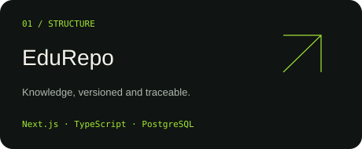
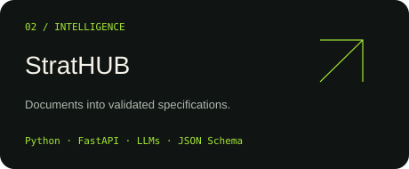
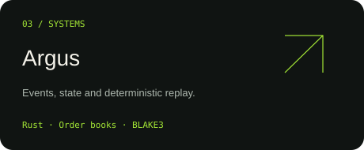
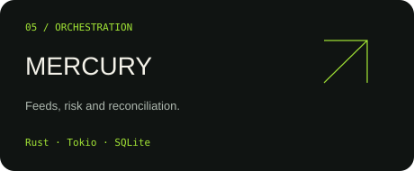
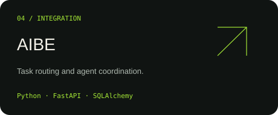

<a href="https://isaacvaleriano.netlify.app/"><picture><source media="(max-width: 600px)" srcset="./assets/builder-banner-mobile.svg"></picture></a>

<a href="https://isaacvaleriano.netlify.app/">Portfolio</a> · <a href="https://www.linkedin.com/in/isaacvaleriano/">LinkedIn</a> · <a href="https://isaacvaleriano.netlify.app/resume-en.pdf">Résumé</a> · <a href="mailto:isaac119eu@gmail.com">Email</a>

<picture><source media="(max-width: 600px)" srcset="./assets/builder-identity-mobile.svg"></picture>

### `isaac@builders-world ~ $ whoami`

I build backend services, AI integrations and data-oriented systems. My professional experience includes backend work at **DIT / IFAL**; my personal projects explore document processing, agent coordination and market-data infrastructure.

I’m studying **Economics at UFAL** and **Data Science at Instituto Infnet**. I’m looking for **100% remote opportunities in Back-End Engineering and Applied AI**, including financial products, with teams in Brazil or abroad.

### `02 / selected constructions`

**[EduRepo](https://github.com/yMScorpion/EduRepo)** — Academic repositories need more than file storage. I explore versioning, collaboration, access control and audit trails using Next.js, TypeScript, Prisma, PostgreSQL and Redis. **Personal project.** [Case study ↗](https://isaacvaleriano.netlify.app/en/projects/edurepo/)

**[StratHUB](https://github.com/yMScorpion/StratHUB)** — Turning information in PDFs into structured strategy specifications through segmentation, embeddings, LLM integration and JSON Schema / semantic validation. **Experimental project, in development.** [Case study ↗](https://isaacvaleriano.netlify.app/en/projects/strathub/)

**[Argus](https://github.com/yMScorpion/Argus)** — Rust foundations for canonical events, L2 order books, JSONL/checkpoints, deterministic replay and observability. **176 local tests passed; public source, in development.** [Case study & evidence ↗](https://isaacvaleriano.netlify.app/en/projects/argus/)

**[MERCURY](https://github.com/yMScorpion/MERCURY)** — Multi-platform event normalization, net-cost spread evaluation, risk gates, dry-run execution and SQLite-backed reconciliation. **78 offline library tests passed; public source, in development.** These are engineering checks, not live trading performance. [Case study & evidence ↗](https://isaacvaleriano.netlify.app/en/projects/mercury/)

**AIBE** — An experimental agent registry and task-routing system with persistence and Python APIs. FastAPI, SQLAlchemy, PostgreSQL and Redis; unit and integration tests. **Private personal project.** [Related project summary ↗](https://isaacvaleriano.netlify.app/en/projects/aibe/)

More experiments

- **[TTSapi](https://github.com/yMScorpion/TTSapi)** — My FastAPI/infrastructure adaptation of StyleTTS2, preserving model-author attribution. Static verification confirms 9 explicit routes, 4 audio formats and 7 Grafana visualization panels; inference was not benchmarked. **Public source; upstream MIT and a noncommercial license for my original API additions.** [Case study & configuration preview ↗](https://isaacvaleriano.netlify.app/en/projects/ttsapi/)
- **[RespiraBem](https://github.com/yMScorpion/RespiraBem)** — Flutter / Dart application with a local schedule, SQLite and weather integration.
- More projects and authorized summaries: **[portfolio ↗](https://isaacvaleriano.netlify.app/#projects)**. Private code and internal data remain private.

### `03 / professional foundation`

**DIT / IFAL · Backend Software Engineer · March 2025 – September 2026**

Contributed to a REST API using **Go, Echo, GORM and PostgreSQL**. Work included refactoring `context.Context` propagation across handlers, services and repositories, plus updates to interfaces, mocks and tests. Institutional repository is private; the portfolio presents an illustrative case study.

[Professional case study ↗](https://isaacvaleriano.netlify.app/en/projects/dit-ifal/)

### `04 / tools & practices`

- **Back-end:** Go, Python, Rust, TypeScript, FastAPI and Echo.
- **Data:** PostgreSQL, Redis, SQL, modeling and validation.
- **Applied AI:** LLMs, embeddings, RAG components and PyTorch.
- **Delivery & quality:** Docker, GitHub Actions, CI/CD, automated tests and observability.

Complete stack — used across professional work and personal projects

- **Back-end:** Go (Golang), Python, Rust, JavaScript, TypeScript, Node.js, FastAPI, Express.js, Echo, GORM, Pydantic, REST APIs, WebSocket, webhooks, async and concurrency.
- **Data:** SQL, PostgreSQL, SQLite, Redis, Prisma, SQLAlchemy, data modeling and validation.
- **AI:** LLMs, embeddings, RAG components, agents, PDFs, JSON Schema, PyTorch, CPU/GPU inference and speech synthesis.
- **Cloud/DevOps:** AWS SDK, S3-compatible storage, Docker, Docker Compose, Kubernetes, Git, GitHub Actions, CI/CD, OpenTelemetry, Prometheus, Grafana and logs.
- **Quality:** DDD, TDD, hexagonal architecture, OOP, refactoring, mocks, pytest, Vitest, Playwright, unit, integration, E2E and property-based tests.
- **Security:** JWT, RBAC, signed URLs, audit trails and upload validation.
- **Web/mobile:** React, Next.js, Vite, Tailwind CSS, HTML5, CSS, Flutter, Dart and responsive design.
- **Other:** CLI, packaging, scheduling, data structures, order books, deterministic replay, risk controls, Scrum and Kanban.

### `05 / learning foundations`

**UFAL** — Bachelor’s degree in Economics, in progress · 2026–2030 expected. 
**Instituto Infnet** — Data Science degree, in progress · 2026–2028 expected. 
**Languages** — Portuguese; advanced English.

### `06 / construction activity`

The calendar uses real public GitHub data. [Source data](./data/contributions.json)

### Let’s build the next chapter.

**Open to 100% remote opportunities in Back-End Engineering and Applied AI.**

[Portfolio ↗](https://isaacvaleriano.netlify.app/) · [LinkedIn ↗](https://www.linkedin.com/in/isaacvaleriano/) · [Résumé ↓](https://isaacvaleriano.netlify.app/resume-en.pdf) · [Email ↗](mailto:isaac119eu@gmail.com)

Apresentação em português

Sou Isaac Valeriano. Construo serviços back-end, integrações de IA e sistemas orientados a dados. Minha experiência profissional inclui trabalho no DIT/IFAL com Go, Echo, GORM e PostgreSQL, entre março de 2025 e setembro de 2026.

Curso Ciências Econômicas na UFAL e Data Science no Instituto Infnet. Nos projetos pessoais, exploro processamento de documentos, integração de LLMs, coordenação de agentes e infraestrutura para dados de mercado.

Busco oportunidades **100% remotas em Back-End e IA aplicada**, no Brasil ou no exterior, com interesse especial em produtos financeiros. Inglês avançado.

[Portfólio](https://isaacvaleriano.netlify.app/) · [Currículo em português](https://isaacvaleriano.netlify.app/curriculo.pdf)

